# QoderResume - Majestic Monolith Web Application Design

## 1. Overview

QoderResume is an AI-powered resume optimization platform built as a majestic monolith for simplified deployment and maintenance. The application combines a Next.js frontend with a NestJS backend in a single deployable unit, supporting resume analysis, job tracking, job description matching, and resume version management.

**Key Characteristics:**
- Single codebase with clear module boundaries
- Unified deployment package
- Shared database and session management
- Real-time WebSocket communication
- Hot-swappable AI providers

### 1.1 Implementation Phases

#### Phase 1 (MVP) - Core Features
**Timeline: 8-10 weeks**
- ✅ **User Authentication**: JWT-based login/registration system
- ✅ **Resume Upload & Analysis**: Single file upload with AI-powered parsing and ATS scoring
- ✅ **Basic Job Tracker**: CRUD operations for job applications with status tracking
- ✅ **Simple JD Matching**: Keyword-based resume-job description comparison
- ✅ **Resume Versions**: Basic version management (last 10 versions)
- ✅ **Admin Dashboard**: System health monitoring and user management
- ✅ **Real-time Updates**: WebSocket integration for progress tracking
- ✅ **Payment System**: Stripe integration with Free and Pro plans
- ✅ **Usage Tracking**: Daily analysis limits and billing management

#### Phase 2 (Enhanced Features)
**Timeline: 6-8 weeks**
- 🔄 **Bulk Resume Processing**: Batch upload and analysis for recruiters
- 🔄 **Calendar Integration**: Google/Outlook sync for interview scheduling
- 🔄 **Automated Reminders**: Follow-up notifications for job applications
- 🔄 **Enhanced JD Matching**: AI-powered suggestion generation with daily limits
- 🔄 **Version Tagging**: Context labels and notes for resume versions
- 🔄 **Audit Logging**: Basic action tracking for compliance
- 🔄 **Subscription Management**: Multi-month plans with discounts and coupon system

#### Phase 3 (Advanced Features)
**Timeline: 8-10 weeks**
- 🔄 **Semantic Matching**: Vector embeddings for deep resume-JD analysis
- 🔄 **Match Score History**: Tracking resume improvement over time
- 🔄 **Advanced Analytics**: LLM cost dashboards and optimization insights
- 🔄 **GDPR Compliance**: Data export and retention policy management
- 🔄 **Feature Flags**: Runtime feature toggles without deployment
- 🔄 **Load Forecasting**: Predictive system capacity planning

## 2. Technology Stack & Dependencies

### Core Framework
- **Frontend:** Next.js 14 with App Router
- **Backend:** NestJS with Express adapter
- **Database:** Supabase PostgreSQL
- **Cache/Queue:** Redis with BullMQ
- **WebSocket:** Socket.IO
- **Authentication:** JWT with NextAuth.js
- **Payment Processing:** Stripe integration

### Supporting Libraries
- **UI Components:** Tailwind CSS, Headless UI
- **State Management:** React Query (TanStack Query)
- **Charts:** Recharts
- **File Upload:** Multer, react-dropzone
- **Validation:** Zod (shared schemas)
- **Testing:** Jest, Playwright
- **Payment Integration:** Stripe SDK, @stripe/stripe-js

### Infrastructure
- **Container:** Docker with multi-stage builds
- **Reverse Proxy:** Nginx
- **SSL/TLS:** Let's Encrypt
- **Monitoring:** Built-in health checks

### Dependency Management
- **Package Lock:** npm shrinkwrap for production builds
- **Version Pinning:** Exact versions for critical dependencies
- **Security Scanning:** npm audit and Snyk integration
- **Update Strategy:** Controlled updates with testing pipeline

## 3. Architecture

### 3.1 Monolith Structure

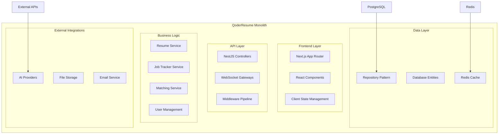

### 3.2 Module Organization

```
src/
├── frontend/                 # Next.js application
│   ├── app/                  # App Router pages
│   ├── components/           # Reusable UI components
│   ├── hooks/               # Custom React hooks
│   ├── lib/                 # Client utilities
│   └── types/               # TypeScript definitions
├── backend/                 # NestJS application
│   ├── modules/             # Feature modules
│   │   ├── auth/            # Authentication & authorization
│   │   ├── resume-analysis/ # AI parsing, ATS scoring
│   │   ├── job-tracker/     # CRUD, filtering, status updates
│   │   ├── jd-matching/     # Resume-JD comparison, AI suggestions
│   │   ├── resume-versions/ # Storage, retrieval, retention enforcement
│   │   ├── admin/           # Monitoring, provider control
│   │   └── shared/          # DTOs, validation pipes, interceptors
│   ├── common/              # Shared utilities
│   ├── config/              # Configuration
│   ├── database/            # Database entities/migrations
│   └── queues/              # BullMQ job processors
├── shared/                  # Shared types and schemas
│   ├── types/
│   ├── schemas/
│   └── constants/
└── infrastructure/          # Deployment configs
    ├── docker/
    ├── nginx/
    └── scripts/
```

### 3.3 Database Architecture

#### Table Partitioning Strategy
```sql
-- Job tracker entries partitioned by user_id for performance
CREATE TABLE job_tracker_entries (
    id UUID PRIMARY KEY,
    user_id UUID NOT NULL,
    vendor_name VARCHAR(255) NOT NULL,
    job_title VARCHAR(255) NOT NULL,
    status job_status_enum NOT NULL,
    created_at TIMESTAMP DEFAULT NOW()
) PARTITION BY HASH (user_id);

-- Create partitions for user data distribution
CREATE TABLE job_tracker_entries_p0 PARTITION OF job_tracker_entries
    FOR VALUES WITH (MODULUS 4, REMAINDER 0);
```

#### Search Optimization
```sql
-- GIN indexes for full-text search in JD/resume matching
CREATE INDEX idx_resume_content_gin ON resumes 
    USING GIN (to_tsvector('english', content));

CREATE INDEX idx_job_description_gin ON jd_analyses 
    USING GIN (to_tsvector('english', job_description));

-- Composite indexes for common query patterns
CREATE INDEX idx_job_tracker_user_status ON job_tracker_entries (user_id, status, created_at);
CREATE INDEX idx_resume_versions_user_date ON resume_versions (user_id, upload_date DESC);
```

### 3.4 Queue Architecture

#### BullMQ Job Types
```typescript
// AI Processing Jobs
interface ResumeAnalysisJob {
  resumeId: string;
  userId: string;
  fileContent: Buffer;
  provider: 'gemini' | 'openai' | 'claude';
}

interface BulkResumeAnalysisJob {
  batchId: string;
  userId: string;
  resumeFiles: { id: string, content: Buffer, fileName: string }[];
  provider: 'gemini' | 'openai' | 'claude';
}

interface JDMatchingJob {
  analysisId: string;
  resumeContent: string;
  jobDescription: string;
  userId: string;
  useSemanticMatching?: boolean;
}

interface SuggestionGenerationJob {
  analysisId: string;
  missedSkills: string[];
  context: string;
  userId: string;
  remainingGenerations: number;
}

// System Jobs
interface ProviderHealthCheckJob {
  providerId: string;
  endpoint: string;
}

interface EmailNotificationJob {
  userId: string;
  template: string;
  data: Record<string, any>;
}

interface ReminderJob {
  jobId: string;
  userId: string;
  reminderType: 'follow_up' | 'interview' | 'deadline';
  scheduledFor: Date;
}

interface DataRetentionJob {
  policy: 'resume_versions' | 'audit_logs' | 'temporary_files';
  retentionDays: number;
  dryRun: boolean;
}

// Billing Jobs
interface SubscriptionRenewalJob {
  subscriptionId: string;
  userId: string;
  attemptNumber: number;
}

interface UsageResetJob {
  userId?: string; // If null, reset for all users
  resetType: 'daily' | 'monthly';
}

interface InvoiceGenerationJob {
  subscriptionId: string;
  billingPeriodStart: Date;
  billingPeriodEnd: Date;
}
```

## 4. Component Architecture

#### Vector Embeddings for Deep Matching

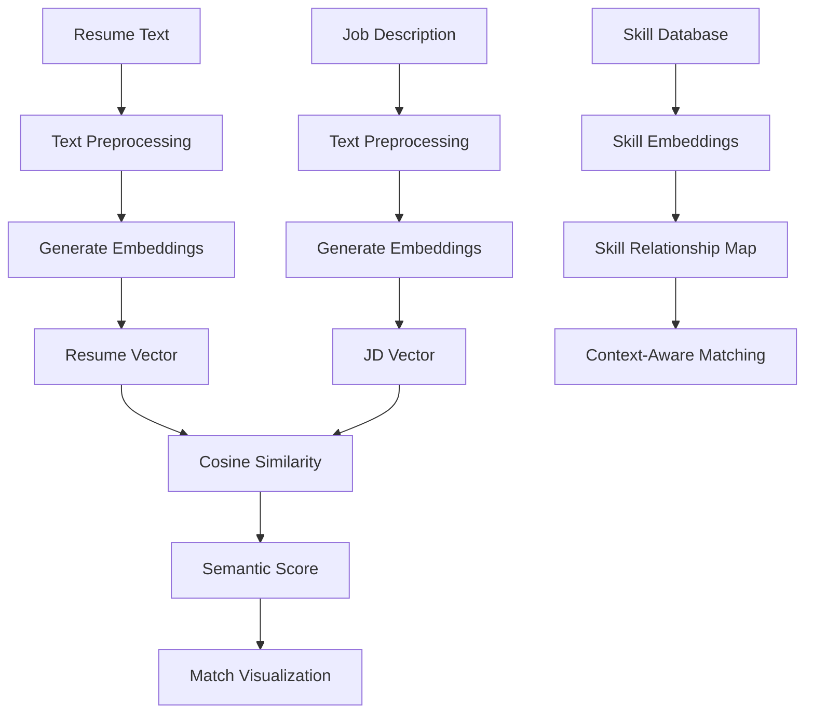

#### Embedding Models and Processing
```typescript
interface SemanticMatchingService {
  generateEmbeddings(text: string): Promise<number[]>;
  calculateSimilarity(vector1: number[], vector2: number[]): number;
  findRelatedSkills(skill: string): Promise<string[]>;
  getMatchExplanation(resumeVector: number[], jdVector: number[]): Promise<MatchExplanation>;
}

interface MatchExplanation {
  overallScore: number;
  skillMatches: SkillMatch[];
  semanticClusters: SemanticCluster[];
  improvementSuggestions: string[];
}

interface SkillMatch {
  skill: string;
  resumeStrength: number;
  jdRequirement: number;
  semanticSimilarity: number;
  relatedSkills: string[];
}
```

### 3.6 Payment & Billing Architecture

#### Subscription Plans Structure

```mermaid
graph TD
    A[User Registration] --> B{Plan Selection}
    B -->|Free| C[Free Plan - 7/month]
    B -->|Pro Monthly| D[Pro Plan - $10/month]
    B -->|Pro 3-Month| E[Pro Plan - $27 (10% off)]
    B -->|Pro 6-Month| F[Pro Plan - $54 (10% off)]
    
    C --> G[Usage Tracking]
    D --> H[Stripe Subscription]
    E --> H
    F --> H
    
    G --> I[Daily Limits]
    H --> J[Monthly Billing]
    
    I --> K[Resume: 7 total]
    I --> L[JD Matching: 7 total]
    
    J --> M[Resume: 12/day]
    J --> N[JD Matching: 12/day]
```

#### Billing Data Models
```typescript
interface SubscriptionPlan {
  id: string;
  name: 'free' | 'pro_monthly' | 'pro_3month' | 'pro_6month';
  displayName: string;
  price: number; // in cents
  interval: 'month' | 'year';
  intervalCount: number;
  features: {
    resumeAnalysisLimit: number;
    jdMatchingLimit: number;
    limitType: 'daily' | 'monthly';
    bulkUpload: boolean;
    calendarIntegration: boolean;
    prioritySupport: boolean;
  };
  discountPercentage?: number;
  stripeProductId?: string;
  stripePriceId?: string;
}

interface UserSubscription {
  id: string;
  userId: string;
  planId: string;
  stripeSubscriptionId?: string;
  status: 'active' | 'canceled' | 'past_due' | 'unpaid';
  currentPeriodStart: Date;
  currentPeriodEnd: Date;
  cancelAtPeriodEnd: boolean;
  createdAt: Date;
  updatedAt: Date;
}

interface UsageRecord {
  id: string;
  userId: string;
  feature: 'resume_analysis' | 'jd_matching';
  date: Date;
  count: number;
  planLimit: number;
}

interface Coupon {
  id: string;
  code: string;
  type: 'percentage' | 'fixed_amount';
  value: number;
  minOrderAmount?: number;
  maxUses?: number;
  usedCount: number;
  validFrom: Date;
  validTo: Date;
  isActive: boolean;
}
```

#### Stripe Integration Service
```typescript
class StripeService {
  async createSubscription(userId: string, planId: string, couponCode?: string): Promise<Subscription> {
    const user = await this.userService.findById(userId);
    const plan = await this.getSubscriptionPlan(planId);
    
    let coupon: Coupon | null = null;
    if (couponCode) {
      coupon = await this.validateCoupon(couponCode, plan.price);
    }
    
    const subscription = await this.stripe.subscriptions.create({
      customer: user.stripeCustomerId,
      items: [{ price: plan.stripePriceId }],
      coupon: coupon?.stripeId,
      metadata: {
        userId,
        planId
      }
    });
    
    return subscription;
  }
  
  async handleWebhook(event: Stripe.Event): Promise<void> {
    switch (event.type) {
      case 'invoice.payment_succeeded':
        await this.handlePaymentSucceeded(event.data.object as Stripe.Invoice);
        break;
      case 'invoice.payment_failed':
        await this.handlePaymentFailed(event.data.object as Stripe.Invoice);
        break;
      case 'customer.subscription.updated':
        await this.handleSubscriptionUpdated(event.data.object as Stripe.Subscription);
        break;
      case 'customer.subscription.deleted':
        await this.handleSubscriptionCanceled(event.data.object as Stripe.Subscription);
        break;
    }
  }
}
```

### 4.1 Frontend Component Hierarchy

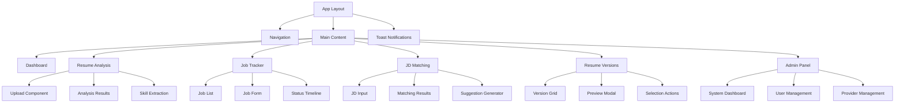

### 4.2 Component Specifications

#### Core Layout Components
- **AppLayout**: Main application shell with navigation and notifications
- **Navigation**: Role-based menu system with active state management
- **ProtectedRoute**: Authentication wrapper for secured pages

#### Resume Analysis Components
- **ResumeUpload**: Drag-and-drop file upload with progress tracking
- **BulkUpload**: Batch resume processing for recruiters and power users
- **AnalysisResults**: Dashboard displaying AI analysis results
- **SkillExtraction**: Interactive skill categorization and scoring
- **ATSScoring**: Visual ATS compatibility assessment
- **BatchAnalysisQueue**: Progress tracking for multiple resume processing

#### Job Tracker Components
- **JobList**: Filterable and sortable job application list
- **JobForm**: Multi-step form for job entry creation/editing
- **StatusTimeline**: Visual representation of application progress
- **VendorManagement**: Vendor contact and relationship tracking
- **CalendarIntegration**: Sync interview dates to Google/Outlook calendars
- **AutomatedReminders**: Follow-up notifications for stale applications
- **ReminderSettings**: Configurable reminder intervals and preferences

#### JD Matching Components
- **JDInput**: Text area and file upload for job descriptions
- **SkillComparison**: Side-by-side skill matching visualization
- **SuggestionGenerator**: AI-powered bullet point generation
- **GapAnalysis**: Missing skills identification and recommendations
- **SemanticMatching**: Vector similarity-based deep matching
- **MatchScoreHistory**: Track resume match score evolution over time
- **EmbeddingVisualizer**: Visual representation of semantic similarity

#### Resume Versions Components
- **VersionGrid**: Display of resume versions with metadata
- **PreviewModal**: Resume preview with version comparison
- **SelectionActions**: Choose versions for analysis or job applications
- **VersionTagging**: Label versions with context and notes
- **VersionNotes**: Rich text editor for version descriptions
- **VersionComparison**: Side-by-side diff view of resume changes

#### Payment & Billing Components
- **SubscriptionPlans**: Display available plans with pricing and features
- **PaymentForm**: Stripe payment form with card input and processing
- **BillingDashboard**: Current plan, usage, and billing history
- **CouponInput**: Coupon code validation and discount application
- **UsageTracker**: Real-time usage display with plan limits
- **UpgradePrompt**: Contextual upgrade suggestions when limits reached
- **InvoiceHistory**: Past billing records and downloadable invoices
- **PlanComparison**: Side-by-side feature and pricing comparison
- **PaymentMethods**: Manage saved payment methods and billing addresses

## 5. Routing & Navigation

### 5.1 Route Structure

```
/                           # Landing page
/auth/login                 # Authentication
/auth/register
/dashboard                  # Main dashboard
/resume/
├── upload                  # Resume upload
├── analysis/:id            # Analysis results
└── versions                # Resume versions
/jobs/
├── tracker                 # Job tracker list
├── create                  # New job entry
└── :id/edit               # Edit job entry
/matching/
├── analyze                 # JD matching interface
└── results/:id            # Matching results
/billing/
├── dashboard              # Billing overview
├── plans                  # Available subscription plans
├── payment                # Payment form and processing
├── invoices               # Billing history
└── usage                  # Current usage statistics
/admin/
├── dashboard              # Admin overview
├── users                  # User management
├── system                 # System monitoring
├── providers              # AI provider management
└── billing                # Billing administration
```

### 5.2 Navigation Guards

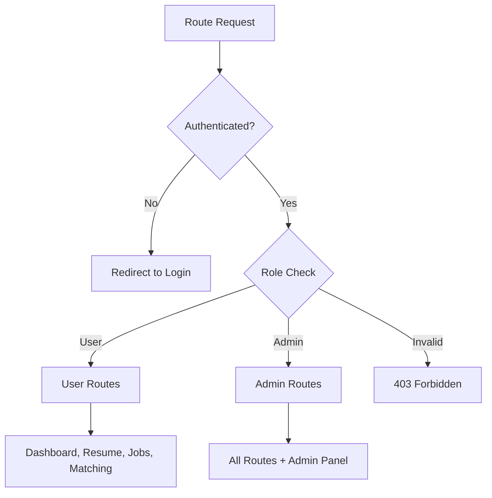

## 6. State Management

### 6.1 Client State Architecture

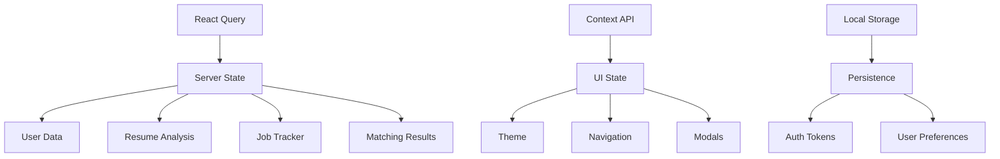

### 6.2 State Management Patterns

#### Server State (React Query)
- **Authentication**: User session and profile data
- **Resume Data**: Analysis results, file metadata, versions
- **Job Tracking**: Job entries, vendor information, status updates
- **Matching Analysis**: JD comparison results, suggestions
- **Admin Data**: System metrics, user management, provider status

#### UI State (Context/useState)
- **Theme Management**: Dark/light mode preferences
- **Navigation State**: Mobile menu, breadcrumbs, active routes
- **Modal Management**: Dialog states, form wizards
- **Toast Notifications**: Success/error message queue
- **Payment Flow**: Stripe payment state, processing status
- **Billing Modals**: Plan selection, coupon application, upgrade prompts

#### Persistent State (Local Storage)
- **User Preferences**: Language, timezone, display settings
- **Form Drafts**: Unsaved job entries, analysis inputs
- **View States**: Table filters, sort preferences
- **Payment Preferences**: Saved billing information, preferred payment methods

## 7. API Integration Layer

### 7.1 API Client Architecture

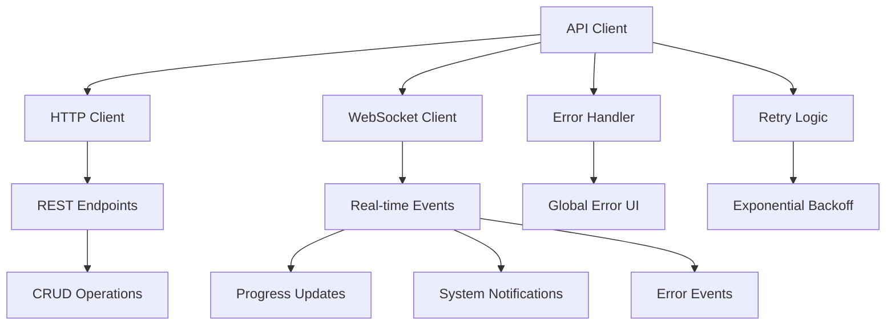

### 7.3 Cache Strategy

#### Cache Layers Architecture

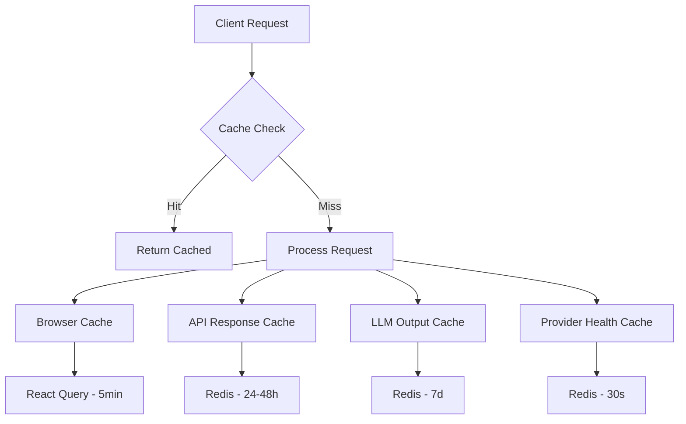

#### Cache Configuration

| Cache Type | Key Pattern | TTL | Invalidation Trigger | Eviction Policy |
|------------|-------------|-----|---------------------|------------------|
| Resume Analysis | `resume:{hash}:analysis` | 48h | Resume deletion/re-upload | LRU |
| JD Matching | `jd-match:{resumeHash}:{jdHash}` | 24h | JD text changes | LRU |
| Semantic Embeddings | `embedding:{textHash}` | 7d | Model version update | LFU |
| LLM Output | `llm:{provider}:{model}:{promptHash}` | 7d | Provider/model change | LRU |
| Provider Health | `provider:{id}:status` | 30s | Manual refresh | TTL |
| Job Tracker List | `jobs:{userId}:{filterHash}` | 5min | CRUD operations | LRU |
| Resume Versions | `versions:{userId}` | 1h | Version add/delete | LRU |
| Bulk Analysis | `bulk:{batchId}:progress` | 2h | Batch completion | TTL |
| Match Score History | `match-history:{resumeId}` | 24h | New analysis | LRU |
| Feature Flags | `flags:all` | 10min | Flag updates | TTL |

#### Redis Memory Management
```redis
# Redis configuration for memory pressure handling
maxmemory 2gb
maxmemory-policy allkeys-lru
maxmemory-samples 5

# Key eviction priorities
# 1. TTL-based keys (provider health, feature flags)
# 2. LRU cache (analysis results, job lists)
# 3. LFU cache (embeddings - keep frequently used)
```

#### Cache Warm-up Strategy
```typescript
class CacheWarmupService {
  async warmupAfterDeploy(): Promise<void> {
    console.log('Starting cache warm-up process...');
    
    // 1. Warm-up feature flags
    await this.loadFeatureFlags();
    
    // 2. Warm-up provider health status
    await this.checkAllProviderHealth();
    
    // 3. Pre-load common embeddings
    await this.preloadCommonSkillEmbeddings();
    
    // 4. Warm-up frequently accessed data
    await this.preloadActiveUserData();
    
    console.log('Cache warm-up completed');
  }
  
  private async preloadCommonSkillEmbeddings(): Promise<void> {
    const commonSkills = [
      'JavaScript', 'Python', 'Java', 'React', 'Node.js',
      'AWS', 'Docker', 'SQL', 'Git', 'Agile'
    ];
    
    await Promise.all(
      commonSkills.map(skill => this.embeddingService.getEmbedding(skill))
    );
  }
  
  private async preloadActiveUserData(): Promise<void> {
    // Load recent active users' job tracker data
    const activeUsers = await this.getRecentlyActiveUsers(100);
    
    await Promise.all(
      activeUsers.map(async (userId) => {
        await this.jobService.getUserJobs(userId, { limit: 20 });
        await this.resumeService.getUserVersions(userId);
      })
    );
  }
}
```

#### Cache Implementation

```typescript
// Resume Analysis Cache
interface ResumeAnalysisCache {
  resumeId: string;
  skills: ExtractedSkill[];
  atsScore: number;
  suggestions: string[];
  processedAt: Date;
}

// Semantic Embeddings Cache
interface EmbeddingCache {
  textHash: string;
  embedding: number[];
  model: string;
  createdAt: Date;
}

// LLM Output Cache for cost optimization
interface LLMOutputCache {
  provider: string;
  model: string;
  promptHash: string;
  response: string;
  tokenCount: number;
  cost: number;
  createdAt: Date;
}

// Bulk Analysis Progress Cache
interface BulkAnalysisCache {
  batchId: string;
  totalFiles: number;
  processedFiles: number;
  currentFile: string;
  results: AnalysisResult[];
  status: 'processing' | 'completed' | 'failed';
}

// Cache service methods
class CacheService {
  async getResumeAnalysis(resumeHash: string): Promise<ResumeAnalysisCache | null>
  async setResumeAnalysis(resumeHash: string, data: ResumeAnalysisCache): Promise<void>
  async getEmbedding(textHash: string): Promise<EmbeddingCache | null>
  async setEmbedding(textHash: string, data: EmbeddingCache): Promise<void>
  async getLLMOutput(provider: string, model: string, promptHash: string): Promise<LLMOutputCache | null>
  async setLLMOutput(provider: string, model: string, promptHash: string, data: LLMOutputCache): Promise<void>
  async getBulkProgress(batchId: string): Promise<BulkAnalysisCache | null>
  async updateBulkProgress(batchId: string, data: Partial<BulkAnalysisCache>): Promise<void>
  async invalidateUserCache(userId: string, pattern: string): Promise<void>
}
```

### 7.4 Error Handling Strategy

#### HTTP Error Mapping
```typescript
const ErrorHandling = {
  400: 'Invalid request data',
  401: 'Authentication required',
  403: 'Access denied',
  404: 'Resource not found',
  409: 'Resource conflict',
  429: 'Rate limit exceeded',
  500: 'Server error - please try again'
}
```

#### WebSocket Error Events
```typescript
// Error event structure
interface ErrorEvent {
  type: 'resume-error' | 'job-tracker-error' | 'jd-analysis-error' | 'matching-error'
  code: string
  message: string
  context?: Record<string, any>
  timestamp: string
  userId: string
}

// Error event examples
'resume-error': { code: 'UPLOAD_FAILED', message: 'File size exceeds limit' }
'job-tracker-error': { code: 'VALIDATION_ERROR', message: 'Invalid job status' }
'jd-analysis-error': { code: 'AI_PROVIDER_UNAVAILABLE', message: 'Analysis service temporarily unavailable' }
'matching-error': { code: 'GENERATION_LIMIT_EXCEEDED', message: 'Daily generation limit reached' }
```

### 7.2 API Endpoints Reference

#### Authentication Endpoints
```
POST   /api/auth/login
POST   /api/auth/register
POST   /api/auth/refresh
DELETE /api/auth/logout
```

#### Resume Management
```
POST   /api/resume/upload
GET    /api/resume/analysis/:id
GET    /api/resume/versions?limit=10  # Auto-enforced limit
DELETE /api/resume/:id
POST   /api/resume/analyze
DELETE /api/resume/versions/cleanup  # Admin endpoint for retention policy
PUT    /api/resume/versions/:id/tag  # Add tags and notes to versions
GET    /api/resume/versions/:id/compare/:compareId # Version comparison
```

**Resume Version Retention Policy:**
- Automatic retention of last 10 versions per user
- Oldest versions auto-deleted when limit exceeded
- Cleanup endpoint for manual policy enforcement
- File storage cleanup triggered on deletion

**Version Management Features:**
- Custom tags for version organization
- Rich text notes for context
- Version comparison and diff viewing
- Export specific versions

#### Job Tracker
```
GET    /api/jobs?status=:status&vendor=:vendor&sortBy=:field&order=:direction&page=:num&limit=:num
POST   /api/jobs
PUT    /api/jobs/:id
DELETE /api/jobs/:id
GET    /api/jobs/vendors
GET    /api/jobs/stats              # Summary statistics
POST   /api/jobs/:id/calendar       # Calendar integration
GET    /api/jobs/reminders          # Active reminders
POST   /api/jobs/reminders/settings # Reminder configuration
```

**Query Parameters for Job Listing:**
- `status`: Filter by job status enum values
- `vendor`: Filter by vendor name (partial match)
- `sortBy`: Sort field (createdAt, updatedAt, jobTitle, vendorName, rate)
- `order`: Sort direction (asc, desc)
- `page`: Page number for pagination
- `limit`: Items per page (max 100)

**Calendar Integration:**
- Google Calendar and Outlook synchronization
- Automatic interview scheduling
- Follow-up reminder creation
- Calendar event updates on status changes

#### JD Matching
```
POST   /api/matching/analyze
GET    /api/matching/results/:id
POST   /api/matching/generate-points
GET    /api/matching/usage/:userId   # Daily usage tracking
GET    /api/matching/semantic        # Semantic similarity analysis
GET    /api/matching/history/:resumeId # Match score history
POST   /api/matching/embeddings      # Generate embeddings for semantic matching
```

**Generate Points Limitations:**
- Maximum 8 points per generation request
- Maximum 50 generations per user per day
- Rate limiting enforced at API level
- Usage tracking stored for billing/analytics

**Semantic Matching Features:**
- Vector embeddings for deep semantic analysis
- Similarity scoring beyond keyword matching
- Context-aware skill relationship detection
- Historical match score tracking and trends

#### Admin Endpoints
```
GET    /api/admin/users
GET    /api/admin/system/health
GET    /api/admin/providers/status
POST   /api/admin/providers/toggle
GET    /api/admin/llm/usage          # LLM usage dashboard
GET    /api/admin/cache/analytics    # Cache performance metrics
GET    /api/admin/audit-logs         # System audit trail
POST   /api/admin/data-retention     # Configure retention policies
GET    /api/admin/feature-flags      # Feature flag management
POST   /api/admin/feature-flags/:flag/toggle
GET    /api/admin/load-forecast      # System load prediction
POST   /api/admin/incident/replay/:jobId # Replay failed jobs
GET    /api/admin/users/:id/export   # GDPR data export
```

### 7.3 WebSocket Events

#### Resume Analysis Events
```typescript
// Client → Server
'resume-upload-start': { fileId: string }
'resume-cancel-upload': { fileId: string }

// Server → Client
'resume-upload-progress': { fileId: string, progress: number }
'resume-upload-completed': { fileId: string, resumeId: string }
'ai-analysis-progress': { resumeId: string, stage: string }
'ai-analysis-completed': { resumeId: string, results: AnalysisResults }
'resume-error': { fileId: string, error: string }
```

#### Bulk Resume Processing Events
```typescript
// Client → Server
'bulk-upload-start': { batchId: string, fileCount: number }
'bulk-upload-cancel': { batchId: string }

// Server → Client
'bulk-upload-progress': { batchId: string, completed: number, total: number, currentFile: string }
'bulk-upload-completed': { batchId: string, results: BatchResults }
'bulk-analysis-progress': { batchId: string, analyzed: number, total: number }
'bulk-analysis-completed': { batchId: string, summary: AnalysisSummary }
```

#### Job Tracker Events
```typescript
// Client → Server
'job-tracker-entry-create': { jobData: JobCreateData }
'job-tracker-entry-update': { jobId: string, updates: Partial<JobData> }
'job-tracker-entry-delete': { jobId: string }
'calendar-sync-request': { jobId: string, calendarType: 'google' | 'outlook' }

// Server → Client
'job-tracker-entry-created': { jobId: string, jobData: JobData }
'job-tracker-entry-updated': { jobId: string, updates: JobData }
'job-tracker-entry-deleted': { jobId: string }
'job-tracker-error': { operation: string, error: string }
'reminder-triggered': { jobId: string, reminderType: string, message: string }
'calendar-sync-completed': { jobId: string, eventId: string }
```

#### JD Matching Events
```typescript
// Client → Server
'jd-analysis-start': { resumeId: string, jobDescription: string }
'jd-generate-points': { analysisId: string, additionalContext?: string }
'semantic-analysis-request': { resumeId: string, jobDescription: string }

// Server → Client
'jd-analysis-progress': { analysisId: string, stage: string, progress: number }
'jd-analysis-completed': { analysisId: string, results: MatchingResults }
'jd-analysis-more-points': { analysisId: string, newPoints: string[], remainingGenerations: number }
'jd-analysis-error': { analysisId: string, error: string }
'jd-generation-limit-reached': { userId: string, dailyLimit: number }
'semantic-analysis-completed': { analysisId: string, semanticScore: number, similarityMap: Record<string, number> }
'match-score-updated': { resumeId: string, newScore: number, previousScore: number, trend: 'up' | 'down' | 'stable' }
```

#### Resume Version Events
```typescript
// Server → Client
'resume-version-added': { versionId: string, fileName: string, uploadDate: string }
'resume-version-deleted': { versionId: string, fileName: string }
'resume-version-cleanup': { deletedVersions: string[], retainedCount: number }
'version-tagged': { versionId: string, tags: string[], notes: string }
'version-comparison-ready': { versionId: string, compareId: string, differences: VersionDiff }
```

#### Admin Events
```typescript
// Server → Client (Admin)
'audit-log-entry': { action: string, userId: string, details: Record<string, any>, timestamp: string }
'feature-flag-updated': { flag: string, enabled: boolean, updatedBy: string }
'data-retention-executed': { policy: string, recordsDeleted: number, executedAt: string }
'load-forecast-updated': { prediction: LoadForecast, accuracy: number }
'incident-replay-completed': { jobId: string, success: boolean, output: any }
```

#### System Events
```typescript
// Server → Client (Admin)
'provider-health-update': { providerId: string, status: ProviderStatus }
'system-metrics': { cpu: number, memory: number, connections: number }
'health-alert': { level: 'warning' | 'critical', message: string }
```

## 8. Testing Strategy

### 8.1 Testing Pyramid

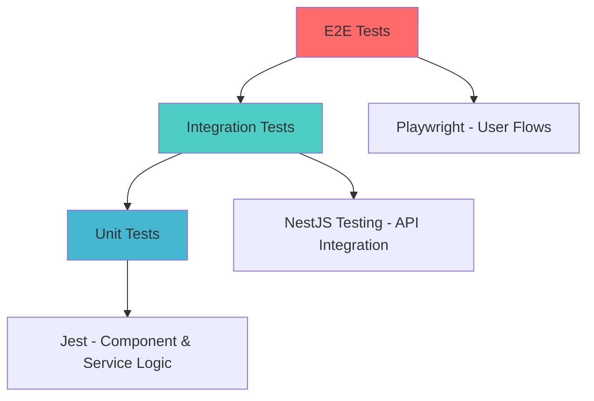

### 8.2 Test Categories

#### Unit Tests (Jest)
- **Frontend**: Component rendering, hook behavior, utility functions
- **Backend**: Service logic, data transformations, validation
- **Shared**: Schema validation, type guards, constants

#### Integration Tests (NestJS Testing Module)
- **API Endpoints**: Request/response validation, authentication
- **Database Operations**: Repository methods, transaction handling
- **WebSocket Events**: Event emission and handling
- **External Integrations**: AI provider interactions (mocked)

#### End-to-End Tests (Playwright)
- **User Authentication**: Login, registration, logout flows
- **Resume Analysis**: Upload, analysis, results display
- **Bulk Resume Processing**: Multi-file upload, batch analysis, progress tracking
- **Resume Versions**: Version listing, preview, selection, deletion, tagging
- **Job Tracking**: CRUD operations, filtering, sorting, status updates, vendor management
- **Calendar Integration**: Google/Outlook sync, reminder scheduling
- **JD Matching**: Analysis workflow, suggestion generation, generation limits, usage tracking
- **Semantic Matching**: Vector similarity analysis, match score tracking
- **Admin Functions**: User management, system monitoring, provider health
- **Compliance Features**: Data export, audit log viewing, retention policy execution
- **Cross-Feature Workflows**: Resume version selection for JD matching, resume attachment to job entries
- **Error Scenarios**: Network failures, file upload errors, AI provider downtime
- **Performance Tests**: Large file uploads, concurrent user sessions, WebSocket connection limits

### 8.3 Test Data Management

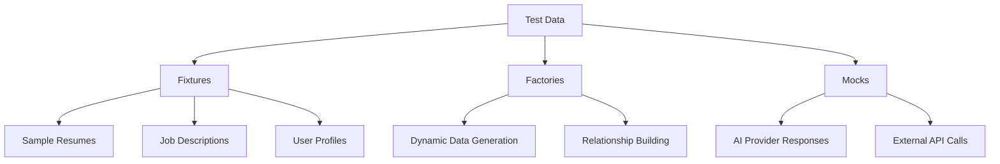

## 9. Deployment Architecture

### 9.1 Container Structure

```dockerfile
# Multi-stage build example
FROM node:18-alpine AS builder
# Build both frontend and backend

FROM node:18-alpine AS runtime
# Runtime container with both apps
EXPOSE 3000 3001
CMD ["npm", "run", "start:monolith"]
```

### 9.2 Deployment Diagram

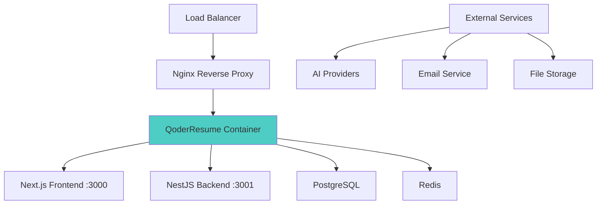

### 9.3 Environment Configuration

#### Development
```yaml
# docker-compose.dev.yml
services:
  app:
    build: .
    ports:
      - "3000:3000"
      - "3001:3001"
    environment:
      - NODE_ENV=development
      - DATABASE_URL=postgresql://...
      - REDIS_URL=redis://...
    volumes:
      - ./src:/app/src
```

#### Production
```yaml
# docker-compose.prod.yml
services:
  app:
    image: qoder-resume:latest
    restart: unless-stopped
    environment:
      - NODE_ENV=production
      # Database Configuration
      - DATABASE_URL=${DATABASE_URL}
      - REDIS_URL=${REDIS_URL}
      
      # Authentication & Security
      - JWT_SECRET=${JWT_SECRET}
      - JWT_EXPIRES_IN=24h
      - BCRYPT_ROUNDS=12
      
      # AI Providers
      - GEMINI_API_KEY=${GEMINI_API_KEY}
      - OPENAI_API_KEY=${OPENAI_API_KEY}
      - CLAUDE_API_KEY=${CLAUDE_API_KEY}
      - DEFAULT_AI_PROVIDER=gemini
      - AI_FALLBACK_ENABLED=true
      
      # File Storage
      - FILE_STORAGE_PROVIDER=supabase
      - SUPABASE_URL=${SUPABASE_URL}
      - SUPABASE_SERVICE_ROLE_KEY=${SUPABASE_SERVICE_ROLE_KEY}
      - MAX_FILE_SIZE=10MB
      - ALLOWED_FILE_TYPES=pdf,docx,txt
      
      # Resume Management
      - RESUME_RETENTION_COUNT=10
      - RESUME_CLEANUP_INTERVAL=24h
      - AUTO_DELETE_OLD_VERSIONS=true
      
      # Rate Limiting
      - JD_GENERATION_DAILY_LIMIT=50
      - JD_GENERATION_POINTS_LIMIT=8
      - API_RATE_LIMIT=100
      - WEBSOCKET_CONNECTION_LIMIT=10000
      
      # Monitoring
      - HEALTH_CHECK_INTERVAL=30s
      - METRICS_COLLECTION_ENABLED=true
      - LOG_LEVEL=info
      
      # Email Service
      - EMAIL_PROVIDER=sendgrid
      - SENDGRID_API_KEY=${SENDGRID_API_KEY}
      - FROM_EMAIL=noreply@qoderresume.com
      
      # Security Headers
      - CORS_ORIGIN=${CORS_ORIGIN}
      - COOKIE_SECURE=true
      - COOKIE_SAME_SITE=strict
    depends_on:
      - postgres
      - redis
      - nginx
```

### 9.4 Environment Variable Reference

#### Core Application
| Variable | Description | Required | Default |
|----------|-------------|----------|----------|
| NODE_ENV | Application environment | Yes | development |
| DATABASE_URL | PostgreSQL connection string | Yes | - |
| REDIS_URL | Redis connection string | Yes | - |
| JWT_SECRET | JWT signing secret | Yes | - |
| JWT_EXPIRES_IN | Token expiration time | No | 24h |

#### AI Providers
| Variable | Description | Required | Default |
|----------|-------------|----------|----------|
| GEMINI_API_KEY | Google Gemini API key | Yes | - |
| OPENAI_API_KEY | OpenAI API key | No | - |
| CLAUDE_API_KEY | Anthropic Claude API key | No | - |
| DEFAULT_AI_PROVIDER | Primary AI provider | No | gemini |
| AI_FALLBACK_ENABLED | Enable provider fallback | No | true |

#### File Management
| Variable | Description | Required | Default |
|----------|-------------|----------|----------|
| FILE_STORAGE_PROVIDER | Storage provider | No | supabase |
| MAX_FILE_SIZE | Maximum upload size | No | 10MB |
| RESUME_RETENTION_COUNT | Versions to retain | No | 10 |
| AUTO_DELETE_OLD_VERSIONS | Auto-cleanup enabled | No | true |

#### Environment Variable Reference

#### Core Application
| Variable | Description | Required | Default |
|----------|-------------|----------|----------|
| NODE_ENV | Application environment | Yes | development |
| DATABASE_URL | PostgreSQL connection string | Yes | - |
| REDIS_URL | Redis connection string | Yes | - |
| JWT_SECRET | JWT signing secret | Yes | - |
| JWT_EXPIRES_IN | Token expiration time | No | 24h |

#### AI Providers
| Variable | Description | Required | Default |
|----------|-------------|----------|----------|
| GEMINI_API_KEY | Google Gemini API key | Yes | - |
| OPENAI_API_KEY | OpenAI API key | No | - |
| CLAUDE_API_KEY | Anthropic Claude API key | No | - |
| DEFAULT_AI_PROVIDER | Primary AI provider | No | gemini |
| AI_FALLBACK_ENABLED | Enable provider fallback | No | true |

#### File Management
| Variable | Description | Required | Default |
|----------|-------------|----------|----------|
| FILE_STORAGE_PROVIDER | Storage provider | No | supabase |
| MAX_FILE_SIZE | Maximum upload size | No | 10MB |
| RESUME_RETENTION_COUNT | Versions to retain | No | 10 |
| AUTO_DELETE_OLD_VERSIONS | Auto-cleanup enabled | No | true |

#### Feature Management
| Variable | Description | Required | Default |
|----------|-------------|----------|----------|
| FEATURE_BULK_UPLOAD | Enable bulk resume processing | No | true |
| FEATURE_SEMANTIC_MATCHING | Enable vector similarity matching | No | true |
| FEATURE_CALENDAR_INTEGRATION | Enable calendar sync | No | true |
| FEATURE_AUDIT_LOGGING | Enable audit trail | No | true |
| FEATURE_DATA_EXPORT | Enable GDPR export | No | true |

#### Calendar Integration
| Variable | Description | Required | Default |
|----------|-------------|----------|----------|
| GOOGLE_CALENDAR_CLIENT_ID | Google Calendar OAuth client ID | No | - |
| GOOGLE_CALENDAR_CLIENT_SECRET | Google Calendar OAuth secret | No | - |
| OUTLOOK_CLIENT_ID | Microsoft Outlook OAuth client ID | No | - |
| OUTLOOK_CLIENT_SECRET | Microsoft Outlook OAuth secret | No | - |

#### Semantic Matching
| Variable | Description | Required | Default |
|----------|-------------|----------|----------|
| EMBEDDING_MODEL | Model for text embeddings | No | all-MiniLM-L6-v2 |
| SEMANTIC_SIMILARITY_THRESHOLD | Minimum similarity score | No | 0.7 |
| VECTOR_DIMENSION | Embedding vector dimensions | No | 384 |

#### Compliance & Security
| Variable | Description | Required | Default |
|----------|-------------|----------|----------|
| AUDIT_LOG_RETENTION_DAYS | Audit log retention period | No | 2555 |
| DATA_EXPORT_ENCRYPTION | Encrypt exported data | No | true |
| GDPR_COMPLIANCE_MODE | Enable GDPR features | No | true |
| AUTO_ANONYMIZATION_DAYS | Auto-anonymize after days | No | 2555 |
| DATABASE_ENCRYPTION_KEY | Database field encryption key | Yes | - |
| BACKUP_ENCRYPTION_KEY | Backup encryption key | Yes | - |

#### Performance Optimization
| Variable | Description | Required | Default |
|----------|-------------|----------|----------|
| PROMPT_OPTIMIZATION_ENABLED | Enable prompt compression | No | true |
| MAX_PROMPT_TOKENS | Maximum tokens per prompt | No | 4000 |
| BULK_PROCESSING_CONCURRENCY | Parallel bulk processing | No | 5 |
| REMINDER_CHECK_INTERVAL | Reminder check frequency | No | 1h |
| JD_GENERATION_DAILY_LIMIT | Daily generation limit | No | 50 |
| JD_GENERATION_POINTS_LIMIT | Points per generation | No | 8 |
| API_RATE_LIMIT | Requests per minute | No | 100 |
| WEBSOCKET_CONNECTION_LIMIT | Max WebSocket connections | No | 10000 |

## 10. Security Considerations

### 10.1 Authentication & Authorization

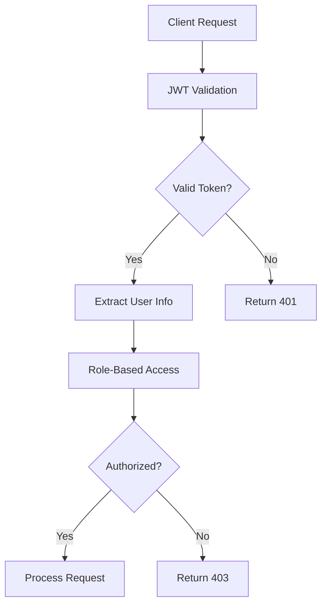

### 10.2 Security Measures

#### Input Validation
- **File Upload**: Type validation, size limits, virus scanning
- **Form Data**: Zod schema validation on both client and server
- **SQL Injection**: Parameterized queries, ORM protection with Prisma/TypeORM
- **XSS Prevention**: Content sanitization with DOMPurify, CSP headers
- **NoSQL Injection**: Input sanitization for Redis operations
- **Path Traversal**: File path validation and sandboxing
- **CSRF Protection**: SameSite cookies and CSRF tokens

#### Data Protection
- **Database Encryption**: PostgreSQL transparent data encryption (TDE)
- **Redis Encryption**: TLS encryption for data in transit and at rest
- **Backup Encryption**: AES-256 encrypted database and file backups
- **Key Management**: Automated secret rotation with HashiCorp Vault integration
- **File Storage**: Secure file handling with access controls and encryption
- **Session Management**: Secure cookie settings, token rotation
- **API Security**: Rate limiting, CORS configuration

#### Infrastructure Security
- **HTTPS Enforcement**: SSL/TLS termination at proxy level
- **Security Headers**: HSTS, CSP, X-Frame-Options
- **Container Security**: Non-root user, minimal attack surface
- **Network Security**: Internal service communication protection

### 10.3 Security & Compliance Features

#### Audit Trail System
```typescript
interface AuditLogEntry {
  id: string;
  userId: string;
  action: string;
  resourceType: 'resume' | 'job' | 'user' | 'system';
  resourceId: string;
  details: Record<string, any>;
  ipAddress: string;
  userAgent: string;
  timestamp: Date;
}

class AuditService {
  async logAction(entry: Omit<AuditLogEntry, 'id' | 'timestamp'>): Promise<void>
  async getAuditTrail(filters: AuditFilters): Promise<AuditLogEntry[]>
  async exportAuditLogs(dateRange: DateRange, format: 'json' | 'csv'): Promise<Buffer>
}
```

#### Data Retention Policy Management
```typescript
interface RetentionPolicy {
  id: string;
  name: string;
  resourceType: 'resume' | 'audit_logs' | 'temporary_files' | 'job_data';
  retentionDays: number;
  autoExecute: boolean;
  lastExecuted?: Date;
  recordsAffected?: number;
}

class RetentionManager {
  async createPolicy(policy: Omit<RetentionPolicy, 'id'>): Promise<RetentionPolicy>
  async executePolicy(policyId: string, dryRun: boolean = false): Promise<RetentionResult>
  async scheduleAutomaticCleanup(): Promise<void>
}
```

#### GDPR/CCPA Compliance Tools
```typescript
class ComplianceService {
  async exportUserData(userId: string): Promise<UserDataExport> {
    return {
      personalInfo: await this.getUserInfo(userId),
      resumes: await this.getUserResumes(userId),
      jobApplications: await this.getUserJobs(userId),
      analysisHistory: await this.getAnalysisHistory(userId),
      auditTrail: await this.getUserAuditTrail(userId)
    };
  }
  
  async deleteUserData(userId: string, retainAuditTrail: boolean = true): Promise<DeletionResult>
  async anonymizeUserData(userId: string): Promise<AnonymizationResult>
}

interface UserDataExport {
  personalInfo: UserProfile;
  resumes: ResumeData[];
  jobApplications: JobData[];
  analysisHistory: AnalysisRecord[];
  auditTrail: AuditLogEntry[];
}
```

### 10.4 Infrastructure Security
- **HTTPS Enforcement**: SSL/TLS termination at proxy level
- **Security Headers**: HSTS, CSP, X-Frame-Options, X-Content-Type-Options
- **Container Security**: Non-root user, minimal attack surface, security scanning
- **Network Security**: Internal service communication protection with mTLS
- **Audit Logging**: Comprehensive action tracking for compliance
- **Data Retention**: Configurable policies for GDPR/CCPA compliance
- **Access Controls**: Role-based permissions with audit trails
- **Secret Management**: Environment-based secrets with rotation policies

#### Security Configuration
```typescript
// CSP Header Configuration
const cspHeader = {
  'Content-Security-Policy': [
    "default-src 'self'",
    "script-src 'self' 'unsafe-inline'",
    "style-src 'self' 'unsafe-inline'",
    "img-src 'self' data: https:",
    "connect-src 'self' wss: https:",
    "frame-ancestors 'none'"
  ].join('; ')
};

// XSS Protection Middleware
class SecurityMiddleware {
  static configureHeaders(app: INestApplication) {
    app.use(helmet({
      contentSecurityPolicy: cspHeader,
      crossOriginEmbedderPolicy: false,
      hsts: {
        maxAge: 31536000,
        includeSubDomains: true,
        preload: true
      }
    }));
  }
}
```

### 11.1 Frontend Optimization

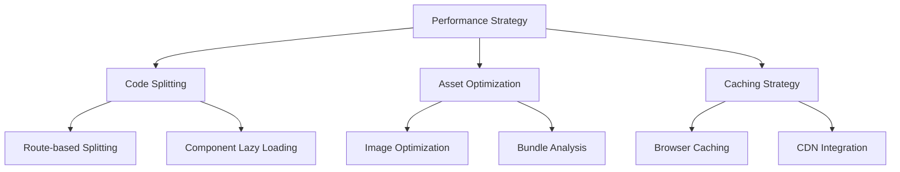

#### Optimization Techniques
- **Next.js App Router**: Automatic code splitting and streaming
- **React Query**: Intelligent caching and background updates
- **Image Optimization**: Next.js Image component with lazy loading
- **Bundle Optimization**: Tree shaking, dynamic imports
- **CSS Optimization**: Tailwind CSS purging, critical CSS

### 11.2 Backend Optimization

#### Database Performance
- **Query Optimization**: Indexed queries, query analysis
- **Connection Pooling**: Efficient database connection management
- **Caching Strategy**: Redis for session data and frequent queries
- **Data Pagination**: Efficient large dataset handling

#### Processing Optimization
- **Queue Management**: BullMQ for async processing
- **WebSocket Scaling**: Efficient connection management
- **File Processing**: Streaming uploads, background processing
- **AI Provider Balancing**: Load distribution across providers

**6. Prompt Optimization Engine**
```typescript
class PromptOptimizer {
  async optimizePrompt(originalPrompt: string, maxTokens: number): Promise<string> {
    // Remove redundant phrases and optimize for token efficiency
    const optimized = await this.removeRedundancy(originalPrompt);
    const compressed = await this.compressContext(optimized, maxTokens);
    return this.validateOptimization(compressed, originalPrompt);
  }
  
  async analyzePromptEfficiency(prompt: string): Promise<PromptAnalysis> {
    return {
      tokenCount: this.estimateTokens(prompt),
      redundancyScore: await this.calculateRedundancy(prompt),
      compressionPotential: await this.estimateCompression(prompt),
      suggestions: await this.generateOptimizationSuggestions(prompt)
    };
  }
}

interface PromptAnalysis {
  tokenCount: number;
  redundancyScore: number;
  compressionPotential: number;
  suggestions: string[];
}
```

#### Cost Control Flow

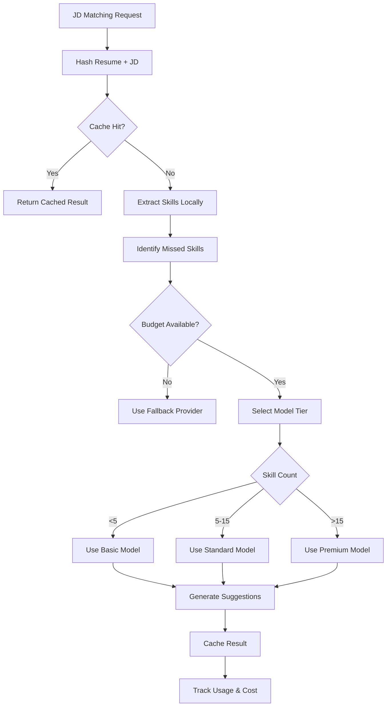

#### Cost Optimization Strategies

**1. Prompt Deduplication**
```typescript
interface PromptCacheKey {
  provider: string;
  model: string;
  promptHash: string; // SHA-256 of prompt + context
}

class LLMCostManager {
  async getOrGenerateResponse(prompt: string, context: any): Promise<string> {
    const promptHash = this.hashPrompt(prompt, context);
    const cached = await this.cache.getLLMOutput(provider, model, promptHash);
    
    if (cached) {
      await this.trackCacheHit(promptHash);
      return cached.response;
    }
    
    const response = await this.callLLM(prompt);
    await this.cache.setLLMOutput(provider, model, promptHash, response);
    return response;
  }
}
```

**2. Tiered Model Selection**
```typescript
interface ModelTier {
  name: string;
  costPerToken: number;
  maxTokens: number;
  useCase: string[];
}

const MODEL_TIERS = {
  basic: {
    name: 'gemini-1.5-flash',
    costPerToken: 0.00001,
    maxTokens: 8000,
    useCase: ['keyword-extraction', 'skill-parsing']
  },
  standard: {
    name: 'gemini-1.5-pro',
    costPerToken: 0.00005,
    maxTokens: 32000,
    useCase: ['bullet-generation', 'gap-analysis']
  },
  premium: {
    name: 'gpt-4-turbo',
    costPerToken: 0.0001,
    maxTokens: 128000,
    useCase: ['complex-analysis', 'strategic-recommendations']
  }
};
```

**3. Token Budgeting**
```typescript
class TokenBudgetManager {
  async preprocessContent(resume: string, jd: string): Promise<{resume: string, jd: string}> {
    // Extract relevant sections using embeddings
    const resumeSections = await this.extractRelevantSections(resume, jd);
    const jdKeywords = await this.extractKeywords(jd);
    
    // Truncate to fit within token budget
    const truncatedResume = this.truncateToTokenLimit(resumeSections.join('\n'), 2000);
    const truncatedJD = this.truncateToTokenLimit(jdKeywords.join(', '), 500);
    
    return { resume: truncatedResume, jd: truncatedJD };
  }
}
```

**4. Usage Tracking & Budgeting**
```typescript
interface LLMUsageRecord {
  userId: string;
  feature: 'resume-analysis' | 'jd-matching' | 'suggestion-generation';
  provider: string;
  model: string;
  tokensUsed: number;
  cost: number;
  timestamp: Date;
}

class UsageTracker {
  async trackUsage(record: LLMUsageRecord): Promise<void> {
    await this.db.llmUsage.create(record);
    await this.updateDailySpend(record.userId, record.cost);
  }
  
  async checkBudgetAvailable(userId: string): Promise<boolean> {
    const dailySpend = await this.getDailySpend(userId);
    return dailySpend < this.getDailyBudgetLimit(userId);
  }
  
  async selectOptimalProvider(feature: string, tokenEstimate: number): Promise<string> {
    const providers = await this.getAvailableProviders();
    return providers.sort((a, b) => 
      this.calculateCost(a, tokenEstimate) - this.calculateCost(b, tokenEstimate)
    )[0];
  }
}
```

**5. Failover Rules**
```typescript
interface FailoverRule {
  trigger: 'budget_exceeded' | 'provider_unavailable' | 'rate_limited';
  action: 'switch_provider' | 'downgrade_model' | 'defer_processing';
  fallbackProvider?: string;
  fallbackModel?: string;
}

const FAILOVER_RULES: FailoverRule[] = [
  {
    trigger: 'budget_exceeded',
    action: 'switch_provider',
    fallbackProvider: 'gemini'
  },
  {
    trigger: 'provider_unavailable',
    action: 'switch_provider',
    fallbackProvider: 'openai'
  },
  {
    trigger: 'rate_limited',
    action: 'defer_processing'
  }
];
```

## 12. Monitoring & Observability

### 12.1 Health Monitoring

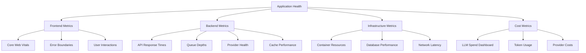

#### Cache Metrics
```typescript
interface CacheMetrics {
  hitRate: number;           // Percentage of cache hits
  missRate: number;          // Percentage of cache misses
  evictionCount: number;     // Number of cache evictions
  averageResponseTime: number; // Average response time for cached vs non-cached
  memoryUsage: number;       // Redis memory consumption
  keyCount: number;          // Total number of cached keys
}

// Cache performance targets
const CACHE_PERFORMANCE_TARGETS = {
  hitRate: 0.70,            // Minimum 70% hit rate
  averageResponseTime: 100,  // Max 100ms for cache retrieval
  memoryUsage: 0.80         // Max 80% Redis memory usage
};
```

#### LLM Cost Dashboard
```typescript
interface LLMCostMetrics {
  dailySpend: number;
  weeklySpend: number;
  monthlySpend: number;
  costPerFeature: Record<string, number>;
  costPerProvider: Record<string, number>;
  tokenUsage: {
    total: number;
    byFeature: Record<string, number>;
    byModel: Record<string, number>;
  };
  budgetUtilization: number; // Percentage of daily budget used
  cacheSavings: number;      // Cost saved through caching
  promptOptimizationSavings: number; // Savings from prompt compression
}

class LLMDashboard {
  async getDailyCostBreakdown(): Promise<LLMCostMetrics>
  async getProviderPerformance(): Promise<ProviderMetrics[]>
  async getCostProjection(): Promise<{daily: number, weekly: number, monthly: number}>
  async getOptimizationRecommendations(): Promise<string[]>
  async getPromptEfficiencyReport(): Promise<PromptEfficiencyMetrics>
}

interface PromptEfficiencyMetrics {
  averageTokensPerPrompt: number;
  optimizationRate: number;
  tokenSavingsPercentage: number;
  topInefficiencies: PromptInefficiency[];
}
```

### 12.2 Alerting Strategy

#### Critical Alerts
- **Service Downtime**: Application or database unavailability
- **Provider Failures**: AI service outages or errors
- **Performance Degradation**: Response times >3s, WebSocket latency >500ms
- **Security Events**: Authentication failures, unusual access patterns
- **Budget Exceeded**: LLM spend >90% of daily budget
- **Cache Failure**: Redis unavailable or cache hit rate <50%
- **Bulk Processing Failure**: Batch analysis failures or queue overload
- **Calendar Sync Failure**: OAuth token expiration or API errors
- **Compliance Violation**: Failed audit log writes or retention policy errors

#### Warning Alerts
- **Resource Usage**: High CPU/memory consumption
- **Queue Backlog**: Processing delays
- **Error Rates**: Increased application errors
- **User Experience**: Poor Core Web Vitals scores
- **Cache Performance**: Hit rate <70%, high eviction rate
- **Cost Anomalies**: LLM spend >80% of budget, unusual token usage patterns
- **Provider Failover**: Automatic provider switches triggered
- **Semantic Matching Degradation**: Embedding generation failures or low similarity scores
- **Feature Flag Changes**: Unexpected feature state changes
- **Data Retention Warnings**: Approaching retention limits or policy execution failures

#### Alert Configuration with Runbook Links
```typescript
interface AlertRule {
  metric: string;
  threshold: number;
  duration: string;
  severity: 'critical' | 'warning' | 'info';
  channels: ('email' | 'slack' | 'webhook')[];
  runbookUrl: string;
  escalationPolicy?: EscalationPolicy;
}

const ALERT_RULES: AlertRule[] = [
  {
    metric: 'cache_hit_rate',
    threshold: 0.70,
    duration: '5m',
    severity: 'warning',
    channels: ['slack'],
    runbookUrl: 'https://docs.qoderresume.com/runbooks/cache-performance'
  },
  {
    metric: 'daily_llm_spend_percentage',
    threshold: 0.90,
    duration: '1m',
    severity: 'critical',
    channels: ['email', 'slack'],
    runbookUrl: 'https://docs.qoderresume.com/runbooks/llm-budget-exceeded'
  },
  {
    metric: 'provider_failover_rate',
    threshold: 5,
    duration: '10m',
    severity: 'warning',
    channels: ['slack'],
    runbookUrl: 'https://docs.qoderresume.com/runbooks/ai-provider-issues'
  },
  {
    metric: 'bulk_processing_failure_rate',
    threshold: 0.10,
    duration: '15m',
    severity: 'warning',
    channels: ['slack'],
    runbookUrl: 'https://docs.qoderresume.com/runbooks/bulk-processing-failures'
  },
  {
    metric: 'semantic_matching_accuracy',
    threshold: 0.80,
    duration: '30m',
    severity: 'warning',
    channels: ['slack'],
    runbookUrl: 'https://docs.qoderresume.com/runbooks/semantic-matching-degradation'
  },
  {
    metric: 'audit_log_write_failures',
    threshold: 1,
    duration: '1m',
    severity: 'critical',
    channels: ['email', 'slack'],
    runbookUrl: 'https://docs.qoderresume.com/runbooks/audit-compliance-issues'
  },
  {
    metric: 'redis_memory_usage',
    threshold: 0.85,
    duration: '5m',
    severity: 'warning',
    channels: ['slack'],
    runbookUrl: 'https://docs.qoderresume.com/runbooks/redis-memory-pressure'
  },
  {
    metric: 'synthetic_check_failure',
    threshold: 1,
    duration: '1m',
    severity: 'critical',
    channels: ['email', 'slack'],
    runbookUrl: 'https://docs.qoderresume.com/runbooks/service-outage'
  }
];

interface EscalationPolicy {
  levels: {
    after: string; // e.g., '15m'
    notify: string[]; // e.g., ['oncall-engineer', 'tech-lead']
  }[];
}
```

#### Synthetic Monitoring
```typescript
// Synthetic monitoring for critical user flows
class SyntheticMonitoring {
  @Cron('*/5 * * * *') // Every 5 minutes
  async runSyntheticChecks(): Promise<void> {
    const checks = [
      this.checkUserRegistration(),
      this.checkResumeUploadFlow(),
      this.checkJobTrackerFlow(),
      this.checkJDMatchingFlow(),
      this.checkAdminDashboard()
    ];
    
    const results = await Promise.allSettled(checks);
    
    results.forEach((result, index) => {
      if (result.status === 'rejected') {
        this.alertService.triggerAlert({
          type: 'synthetic_check_failure',
          checkName: this.getCheckName(index),
          error: result.reason,
          timestamp: new Date()
        });
      }
    });
  }
  
  private async checkResumeUploadFlow(): Promise<void> {
    // Create test user
    const testUser = await this.createTestUser();
    
    // Upload test resume
    const uploadResult = await this.uploadTestResume(testUser.token);
    expect(uploadResult.status).toBe(200);
    
    // Check analysis completion
    await this.waitForAnalysis(uploadResult.data.resumeId, testUser.token);
    
    // Cleanup
    await this.cleanupTestData(testUser.id);
  }
  
  private async checkJDMatchingFlow(): Promise<void> {
    const testUser = await this.createTestUser();
    
    // Upload resume and wait for analysis
    const resume = await this.uploadTestResume(testUser.token);
    await this.waitForAnalysis(resume.data.resumeId, testUser.token);
    
    // Run JD matching
    const matchingResult = await this.runJDMatching(
      resume.data.resumeId,
      'Sample job description for software engineer...',
      testUser.token
    );
    
    expect(matchingResult.status).toBe(200);
    expect(matchingResult.data.matchedSkills).toBeDefined();
    
    await this.cleanupTestData(testUser.id);
  }
}
```

#### Runbook Templates
```markdown
# Runbook: Cache Performance Issues

## Alert: Cache Hit Rate Below 70%

### Immediate Actions (0-5 minutes)
1. Check Redis memory usage: `redis-cli info memory`
2. Check for Redis connectivity issues
3. Verify cache key patterns in logs

### Investigation (5-15 minutes)
1. Analyze cache miss patterns:
   ```bash
   kubectl logs -f deployment/qoder-resume | grep "cache_miss"
   ```
2. Check for recent deployments that might have cleared cache
3. Verify cache TTL settings are appropriate

### Resolution Actions
1. **If Redis is out of memory:**
   - Scale Redis instance or adjust eviction policy
   - Run cache cleanup: `npm run cache:cleanup`

2. **If cache keys are being evicted prematurely:**
   - Adjust TTL values in cache configuration
   - Implement selective cache warming

3. **If new deployment cleared cache:**
   - Run cache warm-up process: `npm run cache:warmup`

### Prevention
- Monitor Redis memory trends
- Implement gradual cache warm-up during deployments
- Set up alerts for Redis memory usage >80%
```