# QoderResume - Application Features and Workflow Guide

## 📋 Table of Contents

- [Application Overview](#application-overview)
- [Core Features](#core-features)
- [User Workflow](#user-workflow)
- [Feature Deep Dive](#feature-deep-dive)
- [User Interface Guide](#user-interface-guide)
- [System Capabilities](#system-capabilities)
- [Business Logic](#business-logic)
- [Data Flow](#data-flow)

## 🎯 Application Overview

**QoderResume** is an AI-powered resume optimization platform designed to enhance job seekers' success rates through intelligent analysis, ATS optimization, and comprehensive job search management. The platform combines advanced AI capabilities with user-friendly interfaces to provide actionable insights and streamline the job application process.

### **Mission Statement**
Empower job seekers with AI-driven insights to optimize their resumes, improve ATS compatibility, and manage their job search effectively.

### **Target Users**
- Job seekers looking to optimize their resumes for better ATS compatibility
- Career changers needing industry-specific guidance
- Recent graduates entering the competitive job market
- Professionals seeking data-driven job search strategies

## 🚀 Core Features

### **1. Resume Analysis & Optimization**

#### **AI-Powered Resume Parsing**
- **Intelligent Content Extraction**: Advanced parsing of PDF, DOCX, and TXT files
- **Skills Identification**: Automatic extraction of technical and soft skills
- **Experience Analysis**: Work history categorization and validation
- **Education Parsing**: Degree, certification, and institution recognition
- **Contact Information**: Professional details extraction and validation

#### **ATS Compatibility Scoring**
- **Comprehensive Scoring**: 0-100 scale based on multiple factors
- **Keyword Optimization**: Industry-specific keyword analysis
- **Format Assessment**: Layout and structure evaluation
- **Section Organization**: Professional resume structure validation
- **Length Optimization**: Content density and page count recommendations

#### **Improvement Suggestions**
- **Content Recommendations**: Specific text improvements
- **Formatting Suggestions**: Layout and design enhancements
- **Keyword Integration**: Strategic keyword placement advice
- **Structure Optimization**: Section reorganization recommendations
- **Industry Alignment**: Role-specific customization suggestions

### **2. Job Description Matching**

#### **Smart Matching Algorithm**
- **Keyword Analysis**: Comprehensive JD-resume keyword comparison
- **Skills Gap Identification**: Missing skills and qualifications highlighting
- **Match Scoring**: Quantified compatibility percentage
- **Relevance Ranking**: Prioritized recommendation list
- **Industry Context**: Sector-specific matching criteria

#### **Optimization Recommendations**
- **Targeted Improvements**: JD-specific resume modifications
- **Keyword Integration**: Strategic keyword placement guidance
- **Skills Enhancement**: Professional development recommendations
- **Experience Highlighting**: Relevant experience emphasis
- **Customization Strategy**: Role-specific resume versions

### **3. Job Application Tracking**

#### **Comprehensive Application Management**
- **Full CRUD Operations**: Create, read, update, delete applications
- **Status Tracking**: Applied, interview, rejected, offer stages
- **Timeline Management**: Application dates and follow-up reminders
- **Company Organization**: Employer-based application grouping
- **Role Categorization**: Position type and industry classification

#### **Advanced Features**
- **Bulk Operations**: Multiple application management
- **Search & Filtering**: Advanced query capabilities
- **Export Functionality**: Data export for external analysis
- **Reminder System**: Follow-up and interview notifications
- **Statistics Dashboard**: Application performance metrics

### **4. Analytics & Insights**

#### **Performance Dashboard**
- **ATS Score Trends**: Historical scoring improvements
- **Application Success Rates**: Interview and offer ratios
- **Industry Performance**: Sector-specific success analysis
- **Time-to-Response**: Average employer response times
- **Skill Market Analysis**: In-demand skills identification

#### **AI-Powered Recommendations**
- **Personalized Suggestions**: User-specific optimization advice
- **Market Insights**: Industry trends and opportunities
- **Skill Development**: Professional growth recommendations
- **Strategy Optimization**: Job search approach improvements
- **Performance Benchmarking**: Peer comparison and positioning

### **5. User Management & Settings**

#### **Account Management**
- **Profile Configuration**: Personal and professional information
- **Security Settings**: Password management and account protection
- **Notification Preferences**: Email and in-app alert customization
- **Privacy Controls**: Data sharing and visibility settings
- **Subscription Management**: Plan selection and billing (Pro features)

## 🎭 User Workflow

### **1. User Onboarding Flow**

#### **Step 1: Account Creation**
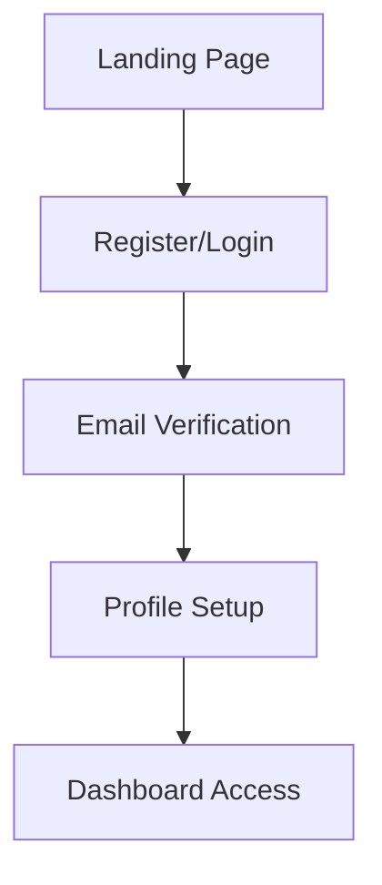

1. **Landing Page**: Feature overview and value proposition
2. **Registration**: Account creation with email verification
3. **Email Verification**: Secure account activation process
4. **Profile Setup**: Basic information and preferences
5. **Dashboard Access**: Welcome to the main application

#### **Step 2: First Resume Upload**
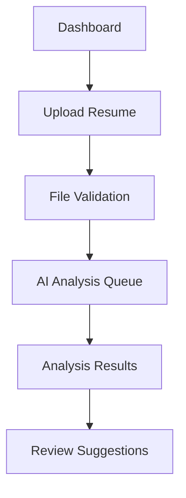

### **2. Resume Optimization Workflow**

#### **Upload and Analysis Process**
1. **File Upload**: Drag-and-drop or file browser selection
2. **Validation**: File type, size, and content verification
3. **AI Processing**: Background analysis with progress tracking
4. **Results Display**: Comprehensive analysis presentation
5. **Improvement Implementation**: Guided optimization process

#### **Iterative Improvement Cycle**
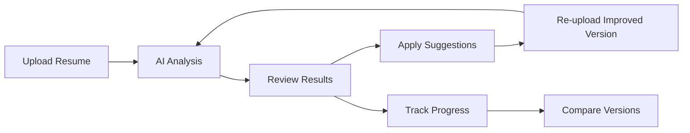

### **3. Job Search Management Workflow**

#### **Job Description Matching**
1. **JD Upload**: Job description text or file upload
2. **Matching Analysis**: Resume-JD compatibility assessment
3. **Gap Identification**: Missing skills and keywords highlighting
4. **Optimization Recommendations**: Specific improvement suggestions
5. **Customized Resume**: Tailored version for application

#### **Application Tracking Process**
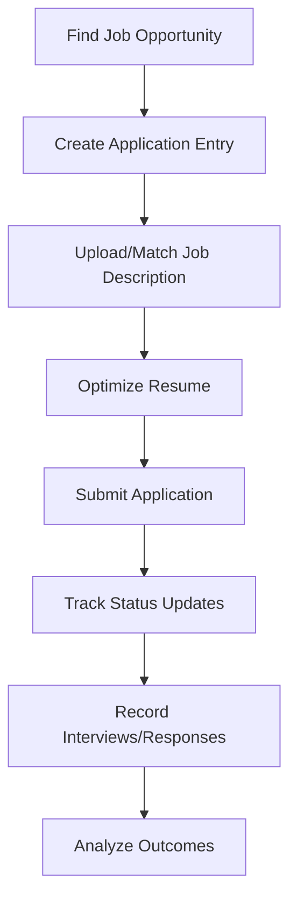

### **4. Analytics and Optimization Workflow**

#### **Performance Monitoring**
1. **Dashboard Review**: Key metrics and trends analysis
2. **Success Rate Evaluation**: Application-to-interview ratios
3. **Skills Analysis**: Market demand vs. current skills
4. **Strategy Adjustment**: Approach optimization based on data
5. **Continuous Improvement**: Ongoing refinement process

## 🔍 Feature Deep Dive

### **Resume Analysis Engine**

#### **Processing Pipeline**
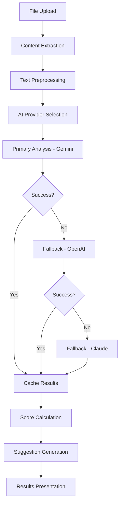

#### **Analysis Components**
- **Content Parsing**: Text extraction and structure recognition
- **Skills Extraction**: Technical and soft skills identification
- **Experience Evaluation**: Work history relevance and impact
- **Education Assessment**: Qualification validation and presentation
- **ATS Scoring**: Multi-factor compatibility evaluation

### **Job Matching Algorithm**

#### **Matching Process**
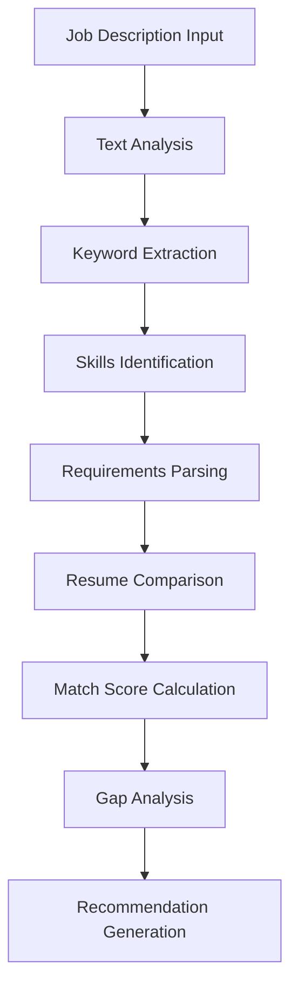

#### **Scoring Methodology**
- **Keyword Overlap**: Direct keyword matching percentage
- **Skills Alignment**: Technical and soft skills compatibility
- **Experience Relevance**: Work history alignment with requirements
- **Education Match**: Qualification requirements fulfillment
- **Industry Context**: Sector-specific evaluation criteria

### **Application Tracking System**

#### **Data Model**
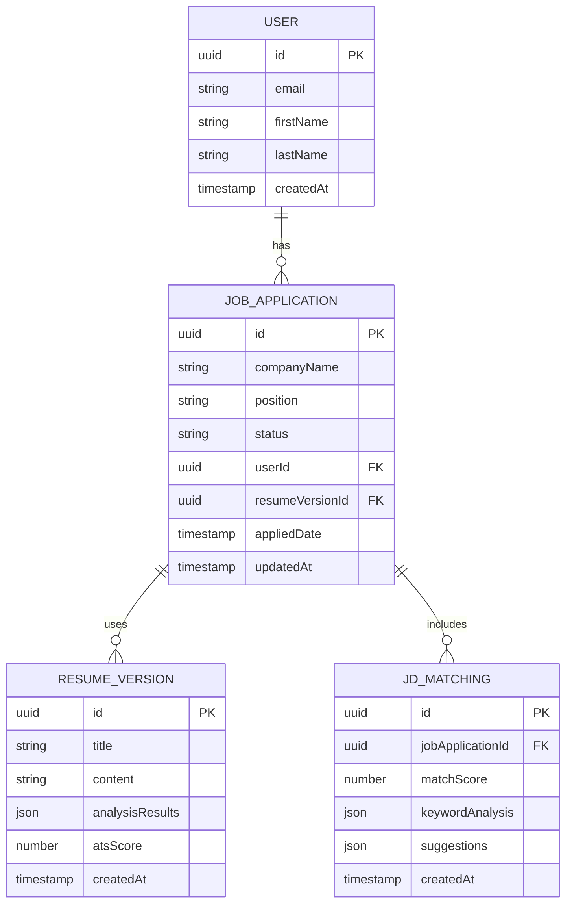

## 🎨 User Interface Guide

### **Dashboard Layout**

#### **Navigation Structure**
```
┌─────────────────────────────────────────────────────┐
│ Header: Logo | Navigation | User Menu               │
├─────────────────────────────────────────────────────┤
│ Sidebar: Tab Navigation                             │
│ ┌─────────────────────────────────────────────────┐ │
│ │ Overview                                        │ │
│ │ Upload Resume                                   │ │
│ │ Analysis Results                                │ │
│ │ Job Matching                                    │ │
│ │ Job Tracker                                     │ │
│ │ Analytics                                       │ │
│ │ Settings                                        │ │
│ └─────────────────────────────────────────────────┘ │
│                                                     │
│ Main Content Area: Dynamic Tab Content             │
│                                                     │
├─────────────────────────────────────────────────────┤
│ Footer: Links | Support | Version                  │
└─────────────────────────────────────────────────────┘
```

#### **Key UI Components**

##### **Advanced File Upload**
- Drag-and-drop functionality with visual feedback
- Progress tracking with percentage completion
- File validation with clear error messages
- Support for PDF, DOCX, and TXT formats
- Size limit enforcement (10MB maximum)

##### **Analysis Results Display**
- ATS score visualization with color-coded indicators
- Detailed suggestion categories with priority levels
- Skills extraction with market relevance indicators
- Before/after comparison for resume versions
- Exportable reports and recommendations

##### **Job Tracker Interface**
- Sortable and filterable application list
- Status-based color coding and progress indicators
- Quick action buttons for status updates
- Bulk operation capabilities
- Search functionality with advanced filters

##### **Analytics Dashboard**
- Interactive charts and graphs
- Performance trend visualization
- Comparative analysis tools
- Exportable reports and insights
- Real-time data updates

### **Mobile Responsiveness**

#### **Responsive Design Features**
- Mobile-first design approach
- Touch-optimized interface elements
- Collapsible navigation for small screens
- Optimized file upload for mobile devices
- Readable typography across all screen sizes

## 🔧 System Capabilities

### **AI Integration**

#### **Multi-Provider Architecture**
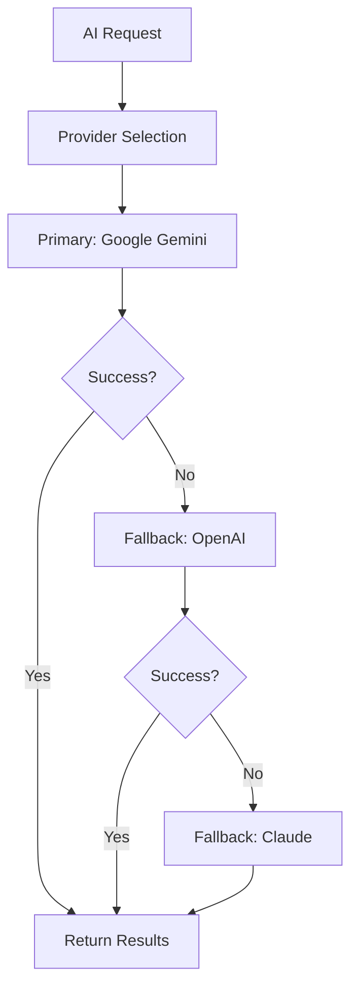

#### **Caching Strategy**
- **Redis Caching**: 24-hour TTL for AI responses
- **Response Optimization**: Reduced API costs through intelligent caching
- **Cache Invalidation**: Smart cache management for accuracy
- **Performance Enhancement**: Faster response times for repeated queries

### **Background Processing**

#### **Queue Management**
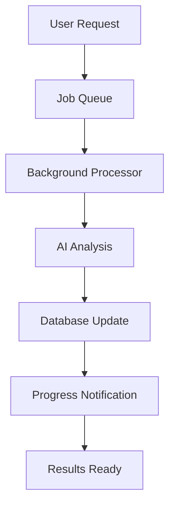

#### **Queue Types**
- **Resume Analysis**: Individual file processing
- **Bulk Analysis**: Multiple file processing
- **JD Matching**: Job description comparison
- **Report Generation**: Analytics and insights

### **Data Management**

#### **Database Architecture**
- **PostgreSQL**: Primary data storage with ACID compliance
- **TypeORM**: Object-relational mapping with migration support
- **Redis**: Caching and session management
- **Backup Strategy**: Automated backup and recovery procedures

#### **Data Security**
- **Encryption**: At-rest and in-transit data encryption
- **Access Control**: Role-based permissions and authentication
- **Audit Logging**: Comprehensive activity tracking
- **Data Retention**: Configurable retention policies

## 🏢 Business Logic

### **Scoring Algorithms**

#### **ATS Score Calculation**
```typescript
interface ATSScoreFactors {
  keywordMatch: number;      // 0-30 points
  formatting: number;        // 0-20 points
  sectionStructure: number;  // 0-20 points
  contentQuality: number;    // 0-20 points
  lengthOptimization: number; // 0-10 points
}

// Total: 0-100 points
```

#### **Match Score Algorithm**
```typescript
interface MatchScoreFactors {
  skillsAlignment: number;     // 0-40 points
  experienceRelevance: number; // 0-30 points
  keywordOverlap: number;      // 0-20 points
  educationMatch: number;      // 0-10 points
}

// Total: 0-100 points
```

### **Recommendation Engine**

#### **Suggestion Categories**
- **Content Improvements**: Text enhancement and optimization
- **Formatting Enhancements**: Layout and visual improvements
- **Keyword Integration**: Strategic keyword placement
- **Structure Optimization**: Section organization and flow
- **Industry Alignment**: Sector-specific customizations

#### **Priority Levels**
- **Critical**: Must-fix issues affecting ATS compatibility
- **High**: Important improvements for better performance
- **Medium**: Beneficial enhancements for optimization
- **Low**: Minor improvements for polish

### **User Progression System**

#### **Achievement Tracking**
- **ATS Score Improvements**: Historical progress monitoring
- **Application Success Rates**: Interview and offer tracking
- **Skill Development**: Professional growth recognition
- **Platform Engagement**: Feature usage and milestones

## 🌊 Data Flow

### **Resume Processing Flow**

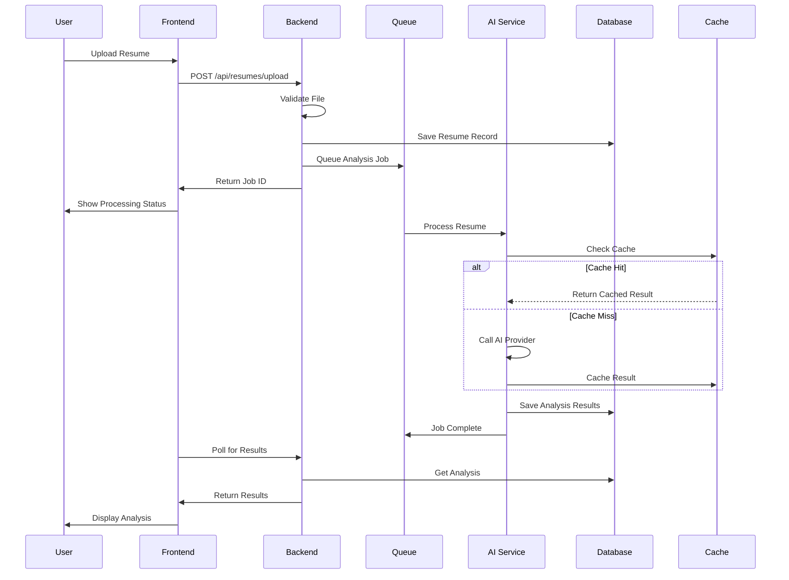

### **Job Matching Flow**

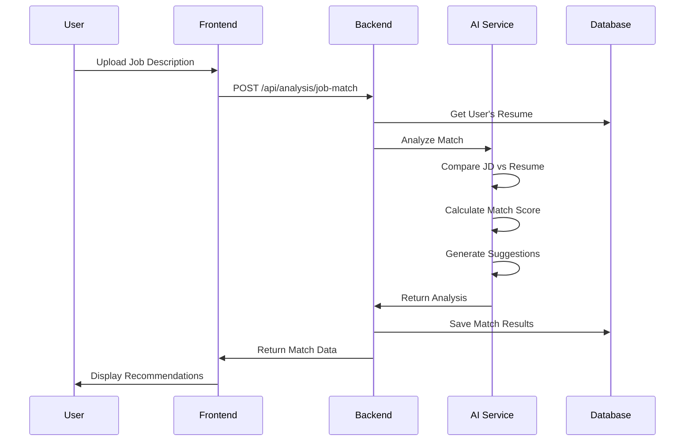

### **Application Tracking Flow**

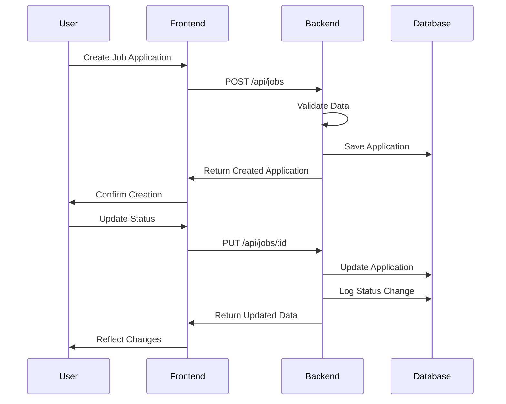

## 🎯 Success Metrics

### **User Engagement**
- **Daily Active Users**: Platform usage frequency
- **Feature Adoption**: Component utilization rates
- **Session Duration**: Time spent per visit
- **Return Rate**: User retention metrics

### **Business Impact**
- **Resume Improvement**: ATS score enhancement rates
- **Job Success**: Interview and offer conversion rates
- **User Satisfaction**: Feedback and rating scores
- **Platform Growth**: User acquisition and retention

### **Technical Performance**
- **Response Times**: API and page load speeds
- **Uptime**: Service availability metrics
- **Error Rates**: System reliability indicators
- **Cache Hit Rates**: Performance optimization metrics

---

**This comprehensive guide covers all aspects of the QoderResume application features and workflows. For technical implementation details, refer to the deployment and API integration documentation.**