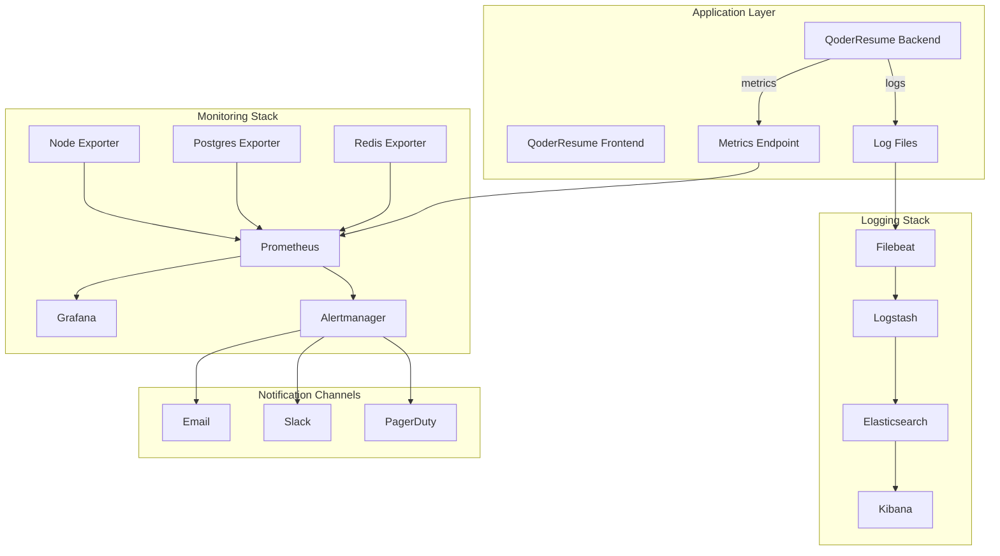

# QoderResume Production Monitoring & Alerting Infrastructure

## 🎯 Overview

This document provides comprehensive documentation for the QoderResume production monitoring and alerting infrastructure. The system provides real-time visibility into application performance, infrastructure health, and business metrics.

## 🏗️ Architecture

### Core Components



### Technology Stack

- **Metrics Collection**: Prometheus + Node/PostgreSQL/Redis Exporters
- **Visualization**: Grafana with custom dashboards
- **Alerting**: Alertmanager with multi-channel notifications
- **Log Aggregation**: ELK Stack (Elasticsearch, Logstash, Kibana)
- **Application Monitoring**: Custom metrics service with structured logging

## 🚀 Quick Start

### Prerequisites

- Docker & Docker Compose
- Node.js >= 18
- QoderResume application running

### Start Monitoring Infrastructure

**Windows:**

```bash
monitoring\scripts\start-monitoring.bat
```

**Linux/Mac:**

```bash
chmod +x monitoring/scripts/start-monitoring.sh
./monitoring/scripts/start-monitoring.sh
```

**With Logging (ELK Stack):**

```bash
./monitoring/scripts/start-monitoring.sh --with-logging
```

### Access URLs

| Service             | URL                           | Credentials    |
| ------------------- | ----------------------------- | -------------- |
| Grafana             | http://localhost:3002         | admin/admin123 |
| Prometheus          | http://localhost:9090         | -              |
| Alertmanager        | http://localhost:9093         | -              |
| Kibana              | http://localhost:5601         | -              |
| Application Metrics | http://localhost:3001/metrics | -              |

## 📊 Dashboards

### 1. Production Monitoring Dashboard

**File**: `monitoring/grafana/dashboards/production-monitoring.json`

**Panels**:

- Application Status & Uptime
- Request Rate & Response Times
- Error Rates & HTTP Status Codes
- Infrastructure Metrics (CPU, Memory, Disk)
- Database Performance
- Queue Processing Status
- AI Service Performance

### 2. Application Dashboard

**File**: `monitoring/grafana/dashboards/application-dashboard.json`

**Panels**:

- User Activity & Sessions
- Resume Processing Metrics
- AI Provider Usage & Performance
- Job Tracking Activity
- Security Events
- File Upload Statistics

### 3. Alerts & SLA Dashboard

**File**: `monitoring/grafana/dashboards/alerts-sla-dashboard.json`

**Panels**:

- SLA Compliance Metrics
- Active Alerts Status
- Critical Alert History
- Performance Thresholds
- Resource Utilization Trends

## 🚨 Alerting

### Alert Severity Levels

| Severity     | Description                     | Response Time | Notification              |
| ------------ | ------------------------------- | ------------- | ------------------------- |
| **Critical** | Production down, data loss risk | Immediate     | Email + Slack + PagerDuty |
| **Warning**  | Performance degradation         | 15 minutes    | Email + Slack             |
| **Info**     | Informational notices           | 1 hour        | Slack                     |

### Key Alerts

#### Application Alerts

- **ApplicationDown**: Service completely unavailable
- **HighErrorRate**: >5% error rate for 2 minutes
- **VeryHighResponseTime**: >5s response time for 3 minutes
- **NoResumeProcessing**: No successful resume analysis for 15 minutes

#### Infrastructure Alerts

- **CriticalCPUUsage**: >90% CPU usage for 3 minutes
- **CriticalMemoryUsage**: >95% memory usage for 2 minutes
- **CriticalDiskUsage**: >95% disk usage for 1 minute

#### Security Alerts

- **AuthenticationFailureSpike**: >5 failed logins per second
- **HighApplicationErrorRate**: Critical errors occurring

#### Database Alerts

- **DatabaseConnectionFailure**: Connection errors detected
- **DatabaseConnectionsHigh**: >80 active connections
- **SlowDatabaseQueries**: >1s query response time

### Notification Channels

#### Email Configuration

```yaml
# monitoring/alertmanager/alertmanager.yml
email_configs:
  - to: "oncall@qoderresume.com"
    subject: "🚨 CRITICAL ALERT - {{ .GroupLabels.alertname }}"
```

#### Slack Integration

```yaml
slack_configs:
  - api_url: "YOUR_SLACK_WEBHOOK_URL"
    channel: "#critical-alerts"
    title: "🚨 CRITICAL: {{ .GroupLabels.alertname }}"
```

#### PagerDuty Integration

```yaml
pagerduty_configs:
  - routing_key: "YOUR_PAGERDUTY_INTEGRATION_KEY"
    description: "{{ .GroupLabels.alertname }}"
```

## 📋 Logging

### Log Types

1. **Application Logs**: General application events
2. **Performance Logs**: Response times, resource usage
3. **Security Logs**: Authentication, authorization events
4. **Error Logs**: Application errors and exceptions
5. **Business Logs**: User actions, feature usage

### Log Structure

```json
{
  "timestamp": "2024-01-08T10:30:00.000Z",
  "level": "INFO",
  "message": "API Request",
  "service": "qoder-resume",
  "environment": "production",
  "type": "api_request",
  "method": "POST",
  "url": "/api/resume/analyze",
  "statusCode": 200,
  "responseTime": 1234,
  "userId": "user-123",
  "correlationId": "req-456"
}
```

### Kibana Index Patterns

- `qoder-resume-logs-*`: General application logs
- `qoder-resume-performance-*`: Performance metrics
- `qoder-resume-security-*`: Security events
- `qoder-resume-errors-*`: Error logs

## 🔧 Configuration

### Environment Variables

```env
# Monitoring
LOG_LEVEL=info
PROMETHEUS_PORT=9090
GRAFANA_PORT=3002
ALERTMANAGER_PORT=9093

# Alerting
SLACK_WEBHOOK_URL=https://hooks.slack.com/services/...
PAGERDUTY_INTEGRATION_KEY=your-key-here
SMTP_HOST=localhost
SMTP_PORT=587

# Logging
ELASTICSEARCH_URL=http://localhost:9200
KIBANA_URL=http://localhost:5601
```

### Prometheus Configuration

**File**: `load-testing/monitoring/prometheus/prometheus.yml`

Key scrape targets:

- QoderResume Backend: `localhost:3001/metrics`
- Node Exporter: `localhost:9100/metrics`
- PostgreSQL Exporter: `localhost:9187/metrics`
- Redis Exporter: `localhost:9121/metrics`

### Alert Rules

**Files**:

- `load-testing/monitoring/prometheus/alert_rules.yml` (Load testing)
- `monitoring/prometheus/production-alert-rules.yml` (Production)

## 📈 Metrics

### Application Metrics

```typescript
// HTTP Request Metrics
http_requests_total{method, route, status_code}
http_request_duration_seconds{method, route, status_code}

// Database Metrics
database_queries_total{query_type, status}
database_query_duration_seconds{query_type}
database_connections_active

// Queue Metrics
queue_jobs_active{queue_name}
queue_jobs_waiting{queue_name}
queue_jobs_completed_total{queue_name, status}
queue_job_duration_seconds{queue_name, job_type}

// AI Service Metrics
ai_requests_total{provider, operation, status}
ai_request_duration_seconds{provider, operation}
ai_tokens_used_total{provider, type}

// Authentication Metrics
auth_attempts_total{method, status}
auth_failures_total{method, reason}
```

### Infrastructure Metrics

```prometheus
# CPU Usage
100 - (avg by (instance) (irate(node_cpu_seconds_total{mode="idle"}[5m])) * 100)

# Memory Usage
(1 - (node_memory_MemAvailable_bytes / node_memory_MemTotal_bytes)) * 100

# Disk Usage
(1 - (node_filesystem_avail_bytes / node_filesystem_size_bytes)) * 100
```

## 🛠️ Maintenance

### Daily Tasks

1. **Check Dashboard Health**
   - Verify all services are green in Grafana
   - Review overnight alerts in Alertmanager
   - Check log volume in Kibana

2. **Performance Review**
   - Review response time trends
   - Check error rate patterns
   - Monitor resource utilization

### Weekly Tasks

1. **Alert Review**
   - Analyze alert frequency and patterns
   - Tune alert thresholds if needed
   - Update runbooks based on incidents

2. **Capacity Planning**
   - Review resource usage trends
   - Plan for capacity increases
   - Optimize slow queries

### Monthly Tasks

1. **Configuration Review**
   - Update alert rules
   - Review and rotate credentials
   - Update dashboard configurations

2. **Performance Analysis**
   - Generate monthly performance reports
   - Identify optimization opportunities
   - Review SLA compliance

## 🔍 Troubleshooting

### Common Issues

#### Prometheus Not Scraping Metrics

```bash
# Check if application is running
curl http://localhost:3001/metrics

# Check Prometheus targets
curl http://localhost:9090/api/v1/targets

# Restart Prometheus
docker-compose -f monitoring/docker-compose.monitoring.yml restart prometheus
```

#### Grafana Dashboards Not Loading

```bash
# Check Grafana logs
docker logs qoder-grafana

# Verify Prometheus data source
curl http://localhost:3002/api/datasources

# Re-import dashboards
# Go to Grafana UI > Import > Upload JSON files
```

#### Alerts Not Firing

```bash
# Check alert rules
curl http://localhost:9090/api/v1/rules

# Check Alertmanager config
curl http://localhost:9093/api/v1/status

# Test alert manually
curl -XPOST http://localhost:9093/api/v1/alerts
```

#### High Log Volume

```bash
# Check log file sizes
du -sh logs/*

# Rotate logs manually
docker exec qoder-logrotate logrotate /etc/logrotate.conf

# Adjust log levels
# Set LOG_LEVEL=warn in environment
```

### Performance Optimization

#### Prometheus Storage

```yaml
# In prometheus.yml
global:
  scrape_interval: 15s
  evaluation_interval: 15s

# Storage retention
command:
  - "--storage.tsdb.retention.time=30d"
  - "--storage.tsdb.retention.size=10GB"
```

#### Grafana Performance

```yaml
# In grafana.ini
[database]
max_connections = 100

[server]
enable_gzip = true

[dashboards]
default_home_dashboard_path = /var/lib/grafana/dashboards/production-monitoring.json
```

## 📞 Support & Escalation

### Contact Information

| Role                | Contact                     | Escalation |
| ------------------- | --------------------------- | ---------- |
| On-Call Engineer    | oncall@qoderresume.com      | 5 minutes  |
| DevOps Team         | devops@qoderresume.com      | 15 minutes |
| Engineering Manager | eng-manager@qoderresume.com | 1 hour     |
| CTO                 | cto@qoderresume.com         | 4 hours    |

### Runbooks

- **Application Down**: [/runbooks/application-down](./runbooks/application-down.md)
- **High Error Rate**: [/runbooks/high-error-rate](./runbooks/high-error-rate.md)
- **Database Issues**: [/runbooks/database-issues](./runbooks/database-issues.md)
- **Performance Issues**: [/runbooks/performance-issues](./runbooks/performance-issues.md)

## 🔐 Security

### Access Control

- Grafana: Admin access required for configuration
- Prometheus: Read-only access for most users
- Alertmanager: Admin access for alert configuration
- Kibana: Role-based access for log data

### Data Retention

- Metrics: 30 days (configurable)
- Logs: 90 days (configurable)
- Alert history: 1 year

### Sensitive Data

- No personal data in metrics
- Sanitized logs (no passwords, tokens)
- Encrypted data in transit
- Secure credential storage

## 📚 Additional Resources

- [Prometheus Documentation](https://prometheus.io/docs/)
- [Grafana Documentation](https://grafana.com/docs/)
- [Alertmanager Documentation](https://prometheus.io/docs/alerting/latest/)
- [ELK Stack Documentation](https://www.elastic.co/guide/)
- [QoderResume Architecture Documentation](../DOCUMENTATION.md)

---

**Last Updated**: 2024-01-08  
**Version**: 1.0  
**Maintainer**: QoderResume DevOps Team
